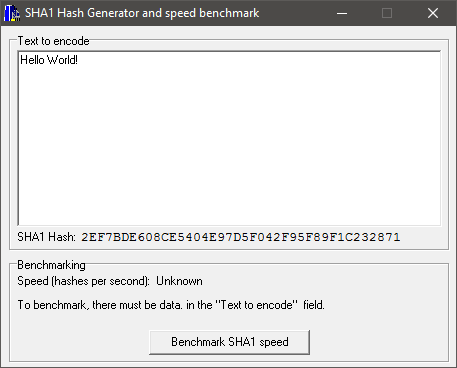

# SHA1 Hash Generator and speed benchmark

### About:
Displays the SHA1 hash of given input text

### Instructions:
Run the .exe, enter some text in to the text field and see the SHA1 hash below it.

### Screenshot:

### Info:
**Created:** 2005

**Operating System:** Windows 2000 or newer

**Compile with:** Borland C++ Builder 6
